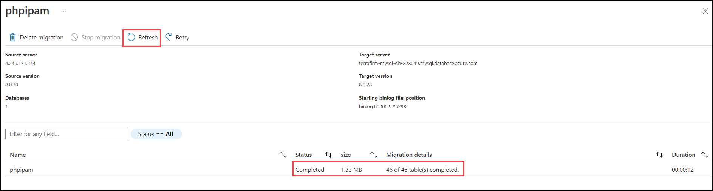

<div class="MCWHeader1">
Building the business migration case with Linux and OSS DB to Azure
</div>

<div class="MCWHeader2">
Hands-on lab step-by-step
</div>

<div class="MCWHeader3">
December 2022
</div>

Information in this document, including URL and other Internet Web site references, is subject to change without notice. Unless otherwise noted, the example companies, organizations, products, domain names, e-mail addresses, logos, people, places, and events depicted herein are fictitious, and no association with any real company, organization, product, domain name, e-mail address, logo, person, place or event is intended or should be inferred. Complying with all applicable copyright laws is the responsibility of the user. Without limiting the rights under copyright, no part of this document may be reproduced, stored in or introduced into a retrieval system, or transmitted in any form or by any means (electronic, mechanical, photocopying, recording, or otherwise), or for any purpose, without the express written permission of Microsoft Corporation.

Microsoft may have patents, patent applications, trademarks, copyrights, or other intellectual property rights covering subject matter in this document. Except as expressly provided in any written license agreement from Microsoft, the furnishing of this document does not give you any license to these patents, trademarks, copyrights, or other intellectual property.

The names of manufacturers, products, or URLs are provided for informational purposes only and Microsoft makes no representations and warranties, either expressed, implied, or statutory, regarding these manufacturers or the use of the products with any Microsoft technologies. The inclusion of a manufacturer or product does not imply endorsement of Microsoft of the manufacturer or product. Links may be provided to third party sites. Such sites are not under the control of Microsoft and Microsoft is not responsible for the contents of any linked site or any link contained in a linked site, or any changes or updates to such sites. Microsoft is not responsible for webcasting or any other form of transmission received from any linked site. Microsoft is providing these links to you only as a convenience, and the inclusion of any link does not imply endorsement of Microsoft of the site or the products contained therein.

© 2022 Microsoft Corporation. All rights reserved.

Microsoft and the trademarks listed at <https://www.microsoft.com/en-us/legal/intellectualproperty/Trademarks/Usage/General.aspx> are trademarks of the Microsoft group of companies. All other trademarks are property of their respective owners.

**Contents** 

<!-- TOC -->

- [Building the business migration case with Linux and OSS DB to Azure hands-on lab step-by-step](#building-the-business-migration-case-with-linux-and-oss-db-to-azure-hands-on-lab-step-by-step)
    - [Abstract and learning objectives](#abstract-and-learning-objectives)
    - [Overview](#overview)
    - [Solution architecture](#solution-architecture)
   
    - [Exercise 1: MySQL database migration](#exercise-1-mysql-database-migration)
        - [Task 1: Create Azure Database for MySQL](#task-1-create-azure-database-for-mysql)
        - [Task 2: Migration MySQL database to Azure](#task-2-migration-mysql-database-to-azure)
    - [Exercise 2: Create VM to migrate web application](#exercise-2-create-vm-to-migrate-web-application)
        - [Task 1: Create Red Hat Enterprise Linux VM for application hosting](#task-1-create-red-hat-enterprise-linux-vm-for-application-hosting)
        - [Task 2: Install web application](#task-2-install-web-application)
    

<!-- /TOC -->

# Building the business migration case with Linux and OSS DB to Azure hands-on lab step-by-step

## Abstract and learning objectives

In this hands-on lab, you will perform steps to migrate Red Hat Enterprise Linux (RHEL) and MySQL database workloads to Azure. You will go through provisioning a Red Hat Enterprise Linux VM and migrate MySQL database to Azure Database for MySQL.

At the end of this hands-on lab, you will be better able to set up a Red Hat Enterprise Linux (RHEL) VM for application migration to Azure and migrate an on-premises MySQL database to Azure Database for MySQL.

## Overview

Terra Firm Laboratories is a global bioengineering company that’s the leading researcher and innovator in genetic and biological science technology. The company was founded in 1975 with its corporate headquarters in Palo Alto, CA. Their mission-critical workloads are currently hosted in an on-premises datacenter and are beginning a journey to modernize and migrate into the cloud using Microsoft Azure.

The CTO, Dennis Nedry, has kicked off an initiative for the organization to begin adopting the Microsoft Azure cloud and modernize its infrastructure. He has already had his team begin assessing their current environment and what it will take to migrate to the cloud. They are looking to optimize their technology investments by reducing technical debt and streamlining operations using Azure Infrastructure-as-a-Service (IaaS) and Platform-as-a-Service (PaaS) cloud services.

This hands-on lab will guide you through the steps to migrate Terra Firm's initial workload to Azure using RedHat Enterprise Linux and MySQL. They already have a Hub and Spoke network set up in Azure with Azure Bastion for enabling remote management of Azure VM using Azure Bastion. The Azure resources you deploy throughout this lab will be deployed within the existing Hub and Spoke networking environment.

## Solution architecture


These are the components of the preferred solution diagram:

- Terra Firm Laboratories has a Hub and Spoke networking setup with Azure ExpressRoute connected to Azure. 
- The PHP web applications have been migrated to Azure and are running in Azure Virtual Machines hosted within a Spoke VNet in Azure that is peered with the Hub VNet.
- The MySQL database has been migrated to Azure Database for MySQL and is integrated with the Spoke VNet in Azure that is peered with the Hub VNet and is accessible from the web application.
- Each application in Azure is contained within its own Subnet with Network Security Groups securing them accordingly.
- Other components that may be setup up according to the client's security requirements are:
    - Azure Bastion for secure SSH access to Azure VMs
    - Azure Firewall to protect the front-end web applications (a common component to use in a secure Azure networking model)
    - Azure Monitor setup to implement monitoring of Azure VMs

## Exercise 1: MySQL database migration

Duration: 60 minutes

In this exercise, you will migrate the on-premises MySQL database for the web application workload to Azure. The Azure Database Migration Service will be used to perform the database migration from the MySQL server on-premises to the Azure Database for MySQL service.

### Task 1: Create Azure Database for MySQL

1. Sign in to the [Azure Portal](https://portal.azure.com). 

2. On the **Home** page within the Azure Portal, towards the top, select **Create a resource**.

    

3. Within the **Search services and marketplace** field, type `mysql`, press Enter, then select **Azure Database for MySQL** in the search results. Click **Create** and select **Azure Database for MySQL**.

    

4. On the **Select Azure Database for MySQL deployment option** pane, under **Flexible server**, select **Create**.

    

5. On the **Flexible server** pane, select the following values:

    - **Resource group**: Select the resource group **Terrafirm-<inject key="DeploymentID" enableCopy="false" />**.
    - **Server name**: Enter a unique name, such as **terrafirm-mysql-db<inject key="DeploymentID" enableCopy="false" />**.
    - **Region**: **<inject key="location" enableCopy="false" />**.
    - **MySQL version**: **8.0**

    

6. Under **Administrator account**, set the **Admin username** and **Password** for the MySQL admin account.
   
    - **Admin username**: `mysqladmin`
    -  **Password**: `demo!pass123`

    

   
7. Select **Next: Networking >**.

    

8. On the **Networking** tab, under **Firewall rules**, select the checkbox for **Allow public access from any Azure service within Azure to this server**.

    

9. Select **Review + create**.

    

10. Select **Create** to provision the service.

    

11. Once provisioning has completed navigate to the **Azure Database for MySQL** resource that was just created, copy and save the **Server name** for use later.

    

12. Select **Databases** under **Settings** on the side of the pane.

    

13. Select **+ Add** to create a new database.

    

14. On the **Create Database** pane, enter `phpipam` in the **Name** field, then select **Save**. This will create a new MySQL database that will be the target for the database migration.

    


### Task 2: Migration MySQL database to Azure

1.  In the Azure Portal, from **Terrafirm-<inject key="DeploymentID" enableCopy="false" />**  resource group navigate to **terrafirm-onprem-workload-vm** and copy the **Public IP address** and paste in any text editor such as *Notepad*.

    

1. Select the Azure **Cloud Shell** icon from the top menu.

    
    
1. In the Cloud Shell window that opens at the bottom of your browser window, select **Bash**.

    

1. If prompted about not having a storage account mounted, click on **Show advanced settings**. Select Create new under Storage account and provide values as below: 
  
      - **Resource Group**: Select **Use existing** then click on **Terrafirm-<inject key="DeploymentID" enableCopy="false" />**
      - **Storage account**: **storage<inject key="DeploymentID" enableCopy="false"/>**
      - **File Share**: **blob**

    

1. Within the **Cloud Shell**, enter the following `ssh` command to connect to the VM using SSH. Be sure to replace the `<ip-address>` placeholder with the **Public IP Address** that was just copied for the VM in step 1.

    ```bash
    ssh demouser@<ip-address>
    ```
1. When prompted, enter `yes` and press Enter to access the certificate warning for this VM. Then continue by entering the **Password** as `demo!pass123` for the VM.

    

1. Next, run the following command to login to mysql server and enter the password as `demopass123`.
    
   ```bash
   mysql -u root -p
    ```
1. Once you are in the mysql server run the following command to create a user and grant previleges to it.

   ```bash
   CREATE USER 'demouser'@'%' IDENTIFIED BY 'demopass123';
   GRANT ALL PRIVILEGES ON *.* TO 'demouser'@'%' WITH GRANT OPTION;
   FLUSH PRIVILEGES;
    ```

1. Navigate to **Terrafirm-<inject key="DeploymentID" enableCopy="false" />**  resource group and click on **terrafirm-database-migration<inject key="DeploymentID" enableCopy="false" />**  *Azure Database Migration Service*,  and select the **+ New Migration Project** button.

    

1. On the **New migration project** blade, select the following values:

    - **Project name**: `phpipam`
    - **Source server type**: `MySQL`
    - **Target server type**: `Azure Database for MySQL (Single or Flexible)`
    - **Migration activity type**: `Offline data migration`

    

1. Select **Create and run activity**.

    

1. On the **MySQL to Azure Database for MySQL Offline Data Migration Wizard** blade, enter the following values on the **Select source** tab, then select **Next: Select target >>**.

    - **Source server name**: Enter the **Public IP Address** of the on-premises workload server named similar to `terrafirm-onprem-workload-vm`.
    - **Server port**: `3306`
    - **User name**: `demouser`
    - **Password**: `demopass123`
    - **Encrypt connection**: Uncheck this box.

    

1. On the **Select target** tab, enter the following values to select the **Azure Database for MySQL** service that was previously provisioned.

    - **Location**: **<inject key="location" enableCopy="false" />**.
    - **Resource group**: Select the resource group **Terrafirm-<inject key="DeploymentID" enableCopy="false" />**.
    - **Azure Database for MySQL**: The Azure Database for MySQL service provisioned previously **terrafirm-mysql-db<inject key="DeploymentID" enableCopy="false" />**.
    - **User name**: **mysqladmin**
    - **Password**: **demo!pass123**

    

1. On the **Select database** tab, ensure the `phpipam` database is selected for both the **Source Database** and **Target Database**, then select **Next: Select tables >>**.

    

1. On the **Select tables** tab, expand the `phpipam` table, and make sure all tables are selected, then select **Review and start migration**.

    

1. On the **Summary** tab, enter `phpipam` into the **Activity name** field, then select **Start migration**.

    

1. A migration details pane will now display, showing the **Status** as **Pending** while the migration is running.

    

1. After a minute, select **Refresh** to check if the migration has been completed. Once complete, the **Status** will show as **Completed** and the **Migration details** will display the total number of tables that have been migrated.

    

## Exercise 2: Create VM to migrate a web application

Duration: 60 minutes

In this exercise, you will create a new Red Hat Enterprise Linux virtual machine (VM) that will be the destination for migrating the on-premises Web Application to Azure, and then you will use SSH to connect to the VM remotely.

### Task 1: Create Red Hat Enterprise Linux VM for application hosting

In this task, you will create a new Red Hat Enterprise Linux virtual machine (VM) that will be the destination for migrating the on-premises Web Application to Azure.

1. Sign in to the [Azure Portal](https://portal.azure.com). 

2. On the **Home** page within the Azure Portal, towards the top, select **Create a resource**.

    

3. Within the **Search services and marketplace** field, type **Red Hat Enterprise Linux** and press Enter to search the marketplace, then select **Red Hat Enterprise Linux**.

    

4. Choose **Red Hat Enterprise Linux 9.0 (LVM)** then select **Create**.

5. On the **Create a virtual machine** pane, set the following values to configure the new virtual machine:

    - **Resource group**: Select the resource group **Terrafirm-<inject key="DeploymentID" enableCopy="false" />**.
    - **Virtual machine name**: Give the VM a unique name, such as **terrafirm-webapp-vm-<inject key="DeploymentID" enableCopy="false" />**.
    - **Region**: **<inject key="location" enableCopy="false" />**.
    - **Image**: Verify the image is set to **Red Hat Enterprise Linux 9.0 (LVM)**.

    

6. Set the **Size** field by selecting the **Standard_D4s_v5** virtual machine size.

    

7. Set the **Authentication type** to **Password**, then enter a **Username** and **Password** for the VM administrator account.

   - **Username:** `demouser` 
   - **Password:** `demo!pass123`

    

    > **Note**: Password authentication for the Linux VM is being used to simplify the lab. In a production environment, the best practice is to use SSH public key authentication.

8. Select **Next** until you are navigated to the **Networking** tab for the **Create a virtual machine** page.

    

9. Provision the VM in the Spoke VNet in Azure by selecting the following values under the **Network interface** section:

    - **Virtual network**: Select the Spoke VNet that was created for this lab. Its name will be similar to `terrafirm-spoke-vnet`
    - **Subnet**: `default (10.2.0.0/24)`

    

10. For the **Public IP**, ensure that a **new** Public IP is selected so a Public IP is provisioned to enable Internet access to the VM. This will be used to access the Web Application over HTTP.

    

11. For the **Select inbound ports**, select the **HTTP (80)** and **SSH (2)** ports to allow both HTTP and SSH traffic through the Network Security Group firewall to reach the VM.

    

12. Select **Review + create** to review the virtual machine settings.

    

13. Select **Create** to begin provisioning the virtual machine once the **Validation passed** message is shown.

    

### Task 2: Install web application

In this task, you will connect to the VM over SSH to install and configure the web application.

1. In the Azure Portal, navigate to the newly created **Virtual Machine**.

    

2. On the **Overview** pane of the **Virtual machine** blade, locate and copy the **Public IP Address** for the VM. This will be used to connect to the VM using SSH.

    

3. In the Azure portal `https://portal.azure.com`, select the Azure **Cloud Shell** icon from the top menu.

    

4. Within the **Cloud Shell**, enter the following `ssh` command to connect to the VM using SSH. Be sure to replace the `<ip-address>` placeholder with the **Public IP Address** that was just copied for the VM in step 2.

    ```bash
    ssh demouser@<ip-address>
    ```

5. When prompted, enter `yes` and press Enter to access the certificate warning for this VM. Then continue by entering the **Password** for the VM.

    

    > **Note**: If you followed the previous suggestions for the VM username and password, then the password for the VM will be `demo!pass123`. Otherwise, enter the password you chose when provisioning the VM.

6. Once connected to the VM via SSH, execute the following commands that will download an install script and run it. This will install the web application on the VM:

    ```bash
    wget https://raw.githubusercontent.com/microsoft/MCW-Building-the-business-migration-case-with-Linux-and-OSS-DB-to-Azure/main/Hands-on%20lab/resources/deployment/install-phpipam.sh
    chmod +x install-phpipam.sh
    sudo ./install-phpipam.sh
    ```

7. Execute the following command to open the `config.php` file for the web application in a text editor. The application needs to be configured to connect to the **Azure Database for MySQL** database that was previously migrated.

    ```bash
    sudo nano /var/www/html/config.php
    ```

    

8. Within the `config.php` file, set the following values for the **database connection details** section to configure it for Azure Database for MySQL.

    - **host**: Enter the **Server name** for the **Azure Database for MySQL** instance that was previously copied in **Exercise 1** .
    - **user**: `mysqladmin`.
    - **pass**: `demo!pass123`.

    

9. To save the file, press `^X` (ctrl-X) to exit the editor, press `Y` to save the modified buffer, then press **Enter** to write the changes to the file.

10. In the Azure Portal, navigate to the **Azure Database for MySQL** instance, then select the **Networking** link under **Settings**. The firewall must be configured to allow the web application to connect to the database.

    

11. On the **Networking** pane, add a new **Firewall rule** with the following values, then select **Save**.

    - **Firewall rule name**: `webapp-vm`
    - **Start IP address**: Enter the **Public IP Address** for the **terrafirm-webapp-vm-<inject key="DeploymentID" enableCopy="false" />** virtual machine.
    - **End IP address**: Enter the **Public IP Address** for the **terrafirm-webapp-vm-<inject key="DeploymentID" enableCopy="false" />** virtual machine.

    

12. Open a new browser tab, and navigate to the following URL to test that the web application is installed. Be sure to use `http://` since the web application is not currently configured for TLS/SSL.

    ```text
    http://<ip-address>
    ```

13. The web application will look similar to the following screenshot. Login using the following credentials:
  
    - **Username**: `Admin`
    - **Password**:`ipamadmin`

   > **Note**: The first time you login to the web application, it will prompt you to change the Admin password. A recommended password to change it to is `demo!pass123`.

   


